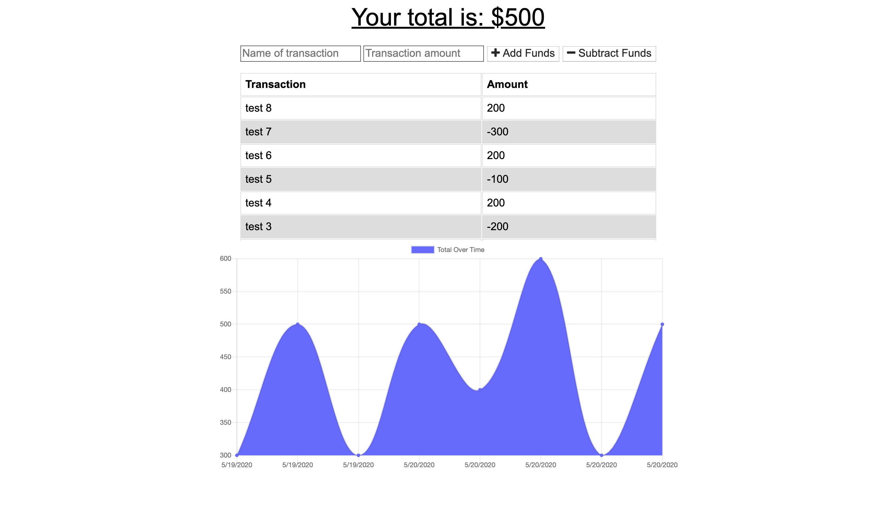

# Budget Tracker PWA

### https://budget-tracker-pwa-cjpalmerin.herokuapp.com/

  
  
  
  

## Description

Keeping track of your budget is incredibly important with or without an internet connection. With this Budget Tracker PWA, you can download the application to your computer or mobile device and keep track of your budget on and offline. If you add data while offline, it will still be there when you're back online!

### Table of Contents

#### [Installation](#installation)  
#### [Usage](#usage)   
#### [License](#license)  
#### [Questions](#questions)  
#### [Contribution](#contribution)  

### Installation

Packages used Express, Compression, Lite-server, Mongoose, Morgan and Routes. Check out the deployment route to use on your system, no installation needed. 

### Usage

When you visit the app you can immediately start entering transactions you have made and view their effects on your budget with the interractive graph. Works on and offline and can be downloaded to your computer or mobile device.

### License

### Contribution

The front end of this homework assignment was provided by the class repo, my assignment was building the PWA aspect with the service-worker, manifest, and indexedDB files.

### Questions

### cjpalmerin@gmail.com

